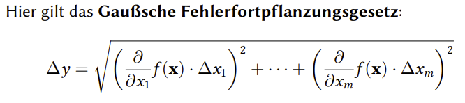
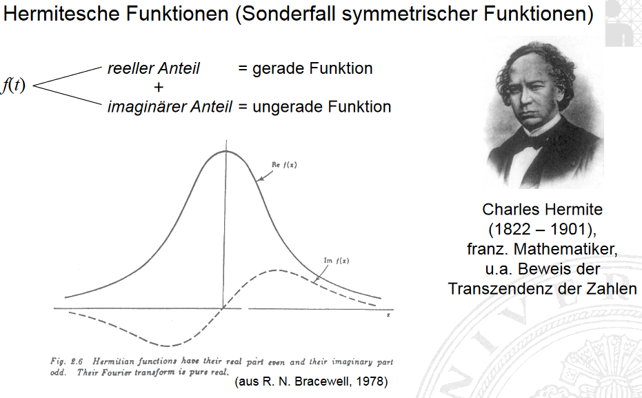
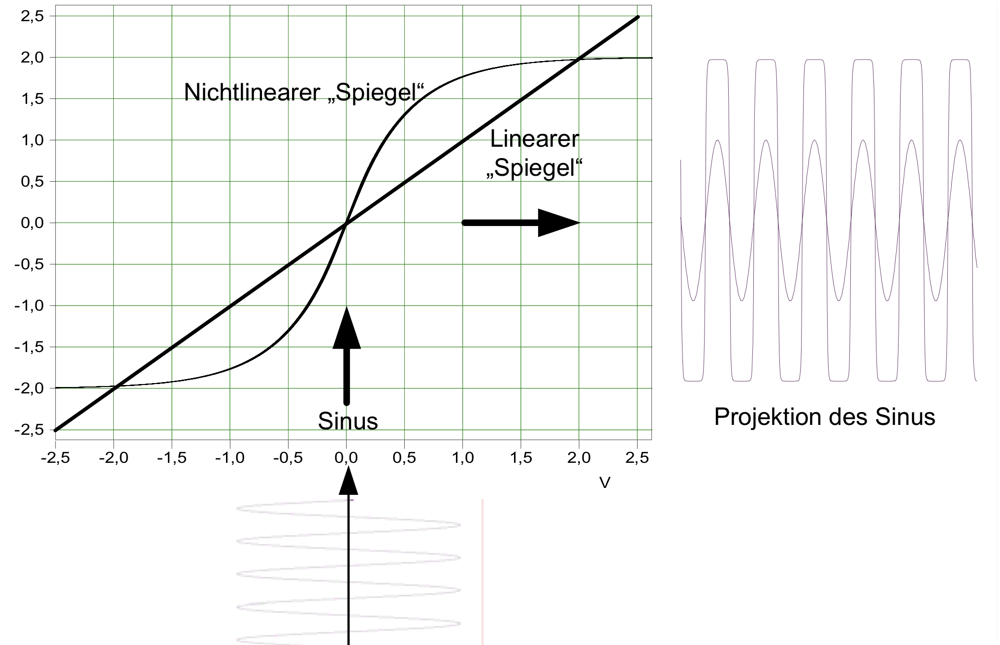
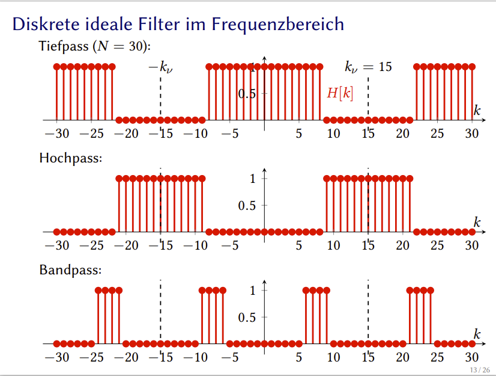

# Fragenkatalog SSS

Alle Angaben sind ohne Gewähr

- [Fragenkatalog SSS](#fragenkatalog-sss)
- [Definitionen](#definitionen)
- [Python](#python)
- [Messungen, Sensoren](#messungen-sensoren)
  - [Messinstrumente](#messinstrumente)
    - [Drehspulinstrument](#drehspulinstrument)
    - [Oszilloskop](#oszilloskop)
  - [Messgrößen](#messgrößen)
  - [Lineare Regression](#lineare-regression)
- [Signale](#signale)
- [Fourier, Spektrum, Phase](#fourier-spektrum-phase)
  - [Fouriertransformation](#fouriertransformation)
  - [Symmetrien](#symmetrien)
  - [harmonische Fourierreihe](#harmonische-fourierreihe)
  - [trigonometrische Fourierreihe](#trigonometrische-fourierreihe)
  - [komplexe Fourierreihe, komplexe Zahlen](#komplexe-fourierreihe-komplexe-zahlen)
  - [Frequenz](#frequenz)
  - [Spektrum, Frequenzspektrum](#spektrum-frequenzspektrum)
  - [Phase, Phasengang, Phasenspektrum](#phase-phasengang-phasenspektrum)
  - [Amplitude, Amplitudengang, Amplitudenspektrum](#amplitude-amplitudengang-amplitudenspektrum)
  - [Dirac](#dirac)
  - [Frequenz-Zeit-Unschärferelation](#frequenz-zeit-unschärferelation)
- [Filter](#filter)
  - [Faltung](#faltung)
- [Bildsignale](#bildsignale)
- [Akustische Signale](#akustische-signale)
- [Systeme](#systeme)
- [Nicht kategorisiert](#nicht-kategorisiert)
- [Neue Fragen](#neue-fragen)

# Definitionen
Signal:
>Schwingung/Wellen\
>Alle Schwingungen sind aus Sinus-Schwingungen verschiedener Frequenz und Amplitude zusammengesetzt

Frequenzgang:
>Zusammenhang zwischen Ein- und Ausgangssignal

Phase/Phasenwinkel:
>Maß für zeitliche Verschiebung der Schwingung gegenüber einer anderen Sinus-Schwingung oder Bezugszeitpunkt (t = 0s)

Amplitude:
>Betrag des Maximalwertes einer Sinus-Schwingung. Ein Maß für Lautstärke oder die in der Sinus-Schwingung enthaltene Energie

Fouriertransformation:
>Verfahren, das Frequenzspektrum des Signals aus dem zeitlichen Verlauf zu berechnen - Analyse

Inverse Fouriertransformation:
> Verfahren, den Zeitverlauf des Signals aus dem Spektrum zu berechnen - Synthese

# Python

Sie haben in Python eine 5 x 5 - Matrix a angelegt. Wie greifen Sie auf das zweite Element der dritten Zeile zu?\

```python
a[3][2]
```

Wie legt man in Python eine 2 x 2 Matrix an, die in der ersten Zeile nur Einsen und in der zweiten Zeile nur Zweien hat?\

```python
import numpy as np
np.array([[1, 1], [2, 2]])
```

# Messungen, Sensoren

Um was für eine Art von Normal handelt es sich bei dem Prototyp des Urkilogramms in Paris?

>Um ein Primärnormal.

Was ist ein frequenzanaloges Ausgangssignal bei einem Sensor?

>Die Frequenz des Eingangssignals bestimmt die Intensität des Ausgangssignals.\
>doppelte Frequenz am Eingang => doppelte Intesität am Ausgang.

## Messinstrumente

Was ist der Unterschied zwischen einem Sensor und einem Messgerät?

>Messgeräte vergleichen zusätzlich den Ausgangswert des Sensors mit einer Bezugsgröße.\
>Analogie: Spannung und Potential. Potential wird erst durch einen Vergleich zur Spannung.

Ein Messinstrument hat einen Anzeigefehler von 1% und einen Skalenendwert von 5 A. Im Moment zeigt das Instrument einen Strom von 2 A an. In welchem Bereich liegt der wahre Wert des Stroms?

>5 * 0.01 = 0.05\
>2 +- 0.05 A

Auf der Anzeige Ihres analogen Messinstrumentes steht "KL 1.5". Was bedeutet das?

>Das bedeutet, dass der Anzeigefehler des Instrumentes bei 1.5% liegt

Warum muss man (bei einem Drehspulinstrument) jede Messung mit dem größten Messbereich beginnen?

>Da bei zu hoher Stromstärke Messinstrumente im kleinen Messbereich kaputt gehen können (Drähte können z.B. verglühen).

Warum sollte man immer im oberen Drittel der Anzeigeskala messen?

>Weil absolute Messfehler (z.B. der Anzeigefehler) bei großen Messwerten weniger ins gewicht fallen als bei kleinen.

Sie messen einen Widerstand R und einen Strom I und wollen daraus die Spannung U nach dem Ohmschen Gesetz bestimmen?
U = R \* I.
Der relative Fehler der Widerstandsmessung sei ΔR, der relative Fehler der Strommessung ΔI. Wie schätzen Sie den relativen Fehler ΔU der Spannungsmessung:

>ΔU = ΔR + ΔI

Durch was entsteht der Anzeigefehler eines Messinstrumentes?

>Aufgrund von Fertigungstoleranzen, Lagerreibung, Montagevariationen der Skala usw.

### Drehspulinstrument

Welche elektrische Größe misst ein Drehspul-Messwerk?

>Stromstärke (I)

Wie funktioniert ein Drehspulinstrument?

>Ein Strom fließt durch eine Spule des Drehspulinstrumentes und erzeugt ein elektromagnetisches Feld. Die Spule ist zwischen dem S- und N-Pol so aufgehangen, dass sie sich drehen kann. An der Spule ist eine Nadel aufgehangen, die auf eine Skala zeigt. Damit der Zeiger nicht direkt auf den Anschlag geht, sorgt eine Spiralfeder für eine Gegenkraft. Je stärker der Strom, der durch die Spule fließt, desto eher richtet sich die Nadel zum N-Pol des Magneten aus.

Warum kann ein Drehspulinstrument nicht beliebig schnell veränderliche Ströme oder Spannungen anzeigen?

>1. Weil Zeiger und Spule sich erste auf einen Gleichgewichtszustand zwischen Magnet- und Rückstellkraft einschwingen müssen
>2. Wegen der Trägheit des Zeigers

Was ist der Parallaxenfehler?

>Ablesefehler, bei dem die Nadel beim Drehspulmessinstrument je nach Blickwinkel auf eine andere Zahl zeigt.

Um was für einen Vorgang handelt es sich bei der Einstellung des Skalennullpunktes eines Drehspulinstruments mithilfe der Rändelschraube im Anzeigefeld?

>Um eine Justierung

Warum hat ein Drehspulinstrument eine Spiralfeder?

>Damit auf den Zeiger eine Rückstellkraft gegen die auslenkende magnetische Kraft erzeugt wird und sich so ein Gleichgewicht einstellen kann.
>Die Rückstellkraft ist bekannt und durch die Auslenkung berechenbar. Dadurch kann die Stromstärke durch die Kraft die anhand der Auslenkung abgelesen wird berechnet werden. 

### Oszilloskop

Zu was benützt man ein Oszilloskop?

>Man benutzt es, um Spannungsverläufe periodischer und einmaliger Signale über der Zeit visuell darzustellen.

Wie funktioniert ein analoges Oszilloskop?

>Ein Glühdraht am hinteren Teil des Oszilloskops erhitzt eine Kathode, von der sich Elektronen lösen, negativ laden und Richtung Anode wandern. Durch einen negativ geladenen Wehneltzylinder werden die Elektronen durch eine Öffnung gedrückt. Nach einem optischen Element, das den Strahl bündelt, werden die Elektronen über 4 Platten, jeweils 2 X- und Y-Platten, abgelenkt beziehungsweise angezogen. Die Y-Ablenkung beziehungsweise Anziehung wird durch das verstärkte Signal bestimmt. Dabei wird eine Spannung an die Platte angelegt, die je nach Intensität des Signals variiert. Die X-Platte sorgt dafür, dass der Strahl von der linken zur rechten Seite des Schirms gelenkt wird. Das wird durch eine Sägezahnspannung sichergestellt.

Was ist der Unterschied zwischen einem Sensor und einem Messgerät?

>Ein Sensor ist Teil eines Messgerätes beziehungsweise einer Messkette des Messgerätes. Er spricht auf bestimmte physikalische / chemische Größen an.
>Der Sensor erfasst einen Wert ohne Bezugsgröße. Bei Messgeräten wird diese Erfassung mit einer Bezugsgröße verglichen.

Was für ein Sensortyp ist der im Praktikum eingesetzte Abstandssensor?

>Extrinsisch, Aktiv

Wie funktioniert die Triggerung beim Oszilloskop?

>Bei jedem Durchlauf wird bis zu einer bestimmten erreichten Spannung die Ablenkung angehalten, damit sichergestellt wird, dass die Perioden des Signals übereinander gezeichnet werden können

Welches Messprinzip liegt dem im Praktikum eingesetzten Abstandssensor zugrunde?

>Leitfähigkeit

Wie schafft es das Oszilloskop, den Elektronenstrahl wiederholt von links nach rechts wandern zu lassen?

>Auf den Kondensator zur Horizontalablenkung wird eine Sägezahnspannung gelegt

## Messgrößen

Eine indirekte Messgröße A berechnet sich als Differenz zweier direkt gemessener Eingangsgrößen B und C mit absolutem Messfehler ΔB bzw. ΔC, d.h. `A = B - C`. Wie groß schätzen Sie den absoluten Messfehler ΔA?

>Er ist die Summe der Messfehler von B und C also ΔA=ΔB+ΔC

Sie haben eine indirekt gemessene Größe A, die von mehreren Eingangsgrößen B, C, D, ... abhängt, die alle den gleichen Messfehler haben. Welche der Eingangsgrößen hat den größten Einfluss auf den Messfehler von A?

>Die mit der größten Gewichtung\
>Diejenige Eingangsgröße, deren partielle Ableitung von A am größten ist.
>\

Sie haben 20 Einzelmessungen mit einer Standardabweichung des Mittelwertes von s. Wie groß ist das Vertrauensintervall, in das der wahre Wert der Messgröße mit einer Wahrscheinlichkeit von 95,5 % fällt?

>+/- 2,09 \* Standardabweichung für den Mittelwert (kap. 04.10)

Wie schätzt man den wahren Wert einer Messgröße, wenn mehrere fehlerbehaftete Messungen vorliegen?

>arithmetisches Mittel aus den Einzelmesswerten

## Lineare Regression

Was leistet die lineare Regression?

>Bestimmung der (linear angenommenen) Übertragungsfunktion 

Kann man die lineare Regression auch bei Kennlinien anwenden, die einem Gesetz der Form
`y = x ^ a` folgen?

>Ja, und zwar in dem man die Eingangsgröße logarithmiert und die Exponentialfunktion als Ausgangsgröße nimmt.\
>Die so skalierte Übertragungsfunktion ist "linearisiert" und dadurch mit lin. reg. berechenbar.

# Signale

Was ist ein gerades Signal?

>Ein gerades Signal ist ein Signal mit Symmetrie zur Y-Achse (f(x) = f(-x))

Was ist ein fastperiodisches Signal?

>Signal das in einem (oder mehreren) Bereich periodisch ist

Welche Bedingungen muss ein aperiodisches Signal NICHT erfüllen, damit sein Fouriertransformierte existiert?

>Es darf innerhalb einer Periode nur unendlich viele Nullstellen haben. (?)\
>Vielleicht spielt er hier auf die 1. Dirichlet-Bedingung an:
>>*f (t) muss über eine Periode absolut integrierbar sein*\
>
>Das stimmt ja nur bedingt, da das Signal ja nur in einem Intervall Integrierbar sein muss oder? 

# Fourier, Spektrum, Phase

Welche Signale lassen sich als Fourierreihe darstellen?

> * Alle physikalisch erzeugbaren Signale
> * Alle Signale, welche die Dirichlet-Bedingungen erfüllen

Betrachten Sie die periodische Funktion `x(t) = 2/t` mit 0 \< t \<\= 1 und der Grundperiode 1 (d.h. Intervall [0, 1] wird unendlich oft wiederholt). Gibt es für diese Funktion eine Darstellung als Fourierreihe? Warum?
>Diese Funktion hat keine Fourierreihe, da sie innerhalb einer Periode unendlich viele Unstetigkeiten hat.

## Fouriertransformation

Wie funktioniert die Kurzzeit-Fouriertransformation?

>1. überlappende Fenster erstellen
>2. Fensterfunktion (bspw. Gauß, Hamming) anwenden
>3. Fenster fourier analysieren (kap. 11.10)

Was muss man bei der Wahl des Fensters bei der Kurzzeit-Fouriertransformation beachten?

>Fenster groß ->hohe Frequenzauflösung, niedrige Zeitauflösung (Sonogramm schmal, aber überlappend)\
>Fenster klein ->hohe Zeitauflösung, niedrige Frequenzauflösung (Sonogramm breit, aber abgegrenzt) (kap. 11.10)

Die Fouriertransformierte von f_1(t) sei F_1(ω), die Fouriertransformierte von f_2(t) sei F_2(ω). Wie sieht die Fouriertransformierte von f(t) = 3\*f_1(t) - 0.7\*f_2(t) aus, und welche Eigenschaft macht man sich dabei zunutze?

>aus der Linearitätseigenschaft folgt F(t) = 3 \* F_1(ω) - 0.7 \* F_2(ω)

Was ist das Gibbs-Phänomen?

>(Gibbsche) Über/Unterschwinger der Fouriertransformierten, deren Amplitude nicht kleiner wird, bei Sprüngen im Ausgangssignal (kap. 08.14)\
>Verschwinden erst, wenn unendlich viele Terme in der Fourrierreihe sind

## Symmetrien

Welche Symmetrien hat die zweiseitige Fourierreihe?

>Y-Achsensymmetrie

Wie unterscheiden sich symmetrische von asymmetrischen Funktionen?

>Symmetrisch: f(-t) = f(t) oder f(-t) = -f(t)\
>Man kann bei Symmetrien die Spektren schätzen:
>
> * Gerades Signal: nur Kosinus-Terme, Imaginärteil: 0
> * Ungerades Signal: nur Sinus-Terme, Realteil: 0

Was bedeutet hermitesch?
>

Wie sieht die Fouriertransformierte eines reellen Signals aus?
>Realteil ist immer Symmetrisch zur Y-Achse und Imaginärteil ist immer symmetrisch zum Ursprung

## harmonische Fourierreihe

Aus welchen Summentermen besteht die harmonische Form der Fourierreihe?

>`A0 + Summe[k](r[k] * cos(ωt - p[k]))`\
>Mit A0 als Gleichanteil, r als Amplitude, ω als Kreisfrequenz und p als Phase

## trigonometrische Fourierreihe

Aus welchen Summentermen besteht die trigonometrische Form der Fourierreihe?

>`A0 + Summe[k](A[k] * sin(kωt) + B[k] * cos(kωt))`\
>Mit A0 als Gleichanteil, ω als Kreisfrequenz und p als Phase.\
>Zur Frage: Aus skalierten, verschobenen Kosinus-Termen.

Welchen Vorteil hat die trigonometrische Form der Fourierreihe gegenüber der harmonischen Form?

>Das Wegfallen der Phase und die unbekannten Fourierkoeffizienten können berechnet werden.

Wie sehen die Fourierkoeffizienten der zweiseitigen trigonometrischen Fourierreihe für `x(t) = a * cos(2 * ω * t)` aus?

>A<sub>-2</sub> = a\/2, A<sub>2</sub> = a\/2

Wie viele Terme hat die **zweiseitige** trigonometrische Fourierreihe von `1 + sin(t) + 3 cos(2t)`?

>5

## komplexe Fourierreihe, komplexe Zahlen

Was ist der Unterschied zwischen dem Skalarprodukt in einem zweidimensionalen Vektorraum und der Multiplikation zweier komplexer Zahlen?

>Beim Skalarprodukt von zweidimensionalen Vektoren kommt eine Zahl hervor. Bei der Multiplikation zweier komplexer Zahlen kommt wieder eine komplexe Zahl raus.

Was ist der Unterschied zwischen der Menge der zweidimensionalen Vektoren und den komplexen Zahlen?

>Es gibt keinen Unterschied.

Aus welchen Grundsignalen besteht die komplexe Fourierreihe?

>Realteil beziehungsweise Cos-Anteil und Imaginärteil beziehungsweise Sin-Anteil.\
>Zur Frage: Aus komplexen Zahlen

Was haben komplexe Zahlen mit Sinusschwingungen zu tun?

>Mithilfe der komplexen Fouriertransformation lassen sich Sinusschwingungen in der kartesischen Darstellung der komplexen Zahlen darstellen.
>Der Imaginärteil der komplexen Zahl entspricht hier dem Sinusanteil.

## Frequenz

Wie berechnet sich die Frequenz einer Sinusschwingung, das aus der Summe einer Sinus- und einer Kosinusfunktion gleicher Frequenz entsteht?

>Frequenz bleibt gleich

## Spektrum, Frequenzspektrum

Wie unterscheidet sich das Spektrum periodischer Rechteckimpulse von einer Gauß-Impulsfolge und warum?

>Rechteckimpulse besitzen unendlich hohe Frequenzen

Sie beobachten ein Spektrum aus mehreren Linien bei 100 Hz, 200 Hz, 270 Hz, 400 Hz und 800 Hz. Um was für einen Signaltyp handelt es sich?

>quasiperiodisches Signal.

Wie sieht das Spektrum eines einzelnen Rechteckimpulses aus?

>Sinc-Funktion.

Sie zerlegen ein relativ glattes, periodisches Signal in mehrere Abschnitte und bestimmen in jedem Abschnitt die lokale Fouriertransformation. Wie unterscheiden sich die lokalen Spektra vom Gesamtspektrum und warum?

>mehr hohe Frequenzen, wegen den Sprüngen an den Fensterrändern.
>langes Signal und großes Fenster -> wenig Unterschied zwischen Fenster und gesamten Signal.
>kurzes Signal und kleine Fenster -> großer Unterschied, da keine Frequenzlokalisierung mehr möglich.

Bei dem Spektrum eines Signals ist der Realteil gerade und der Imaginärteil ungerade. Um was für einen Signaltyp handelt es sich?

>reelles Signal, ohne Symmetrie, da gerade und ungerade Anteile enthalten sind.

Wie unterscheiden sich die Spektren von schnell und langsam veränderlichen Signalen?

>Die Spektren schnell veränderlicher Signale haben „unendlich“ hohe Frequenzen.

Wie verändert sich das Spektrums einer Rechteckschwingung mit **fester Impulsdauer**, bei der die Periode immer weiter erhöht wird?

>Das Experiment zeigt: wird die Periodendauer T (bei gleichbleibender Impulsdauer) größer, so wird der Abstand der Linien 1/T notwendigerweise immer enger.

Was ist der Unterschied zwischen der Fourierreihe und dem Spektrum eines periodischen
Signals?

>Das Spektrum der kontinuierlichen Fouriertransformation lässt sich als Grenzfall des Linienspektrums der Fourierreihe für den Grenzübergang T -> unendl. einer unendlich großen Signal-Periodendauer darstellen.

Wie wirkt ein lineares System auf das Spektrum eines Signals?

>Wird auf den Eingang (oder die Eingänge) eines Systems ein sinusförmiges Signal beliebiger Frequenz gegeben und erscheint am Ausgang lediglich ein sinusförmiges Signal genau dieser Frequenz, so ist der Prozess linear. (kap. 12.6) ->spektrum hat gleiche 1. harmonische? (kap. 12.6 ff)
>
>Ein lineares System faltet ein Signal im Ortsraum. Faltung im Ortsraum entspricht Multiplikation im Frequenzraum.

Was passiert mit dem Spektrum eines Signals, wenn man es in zeitlicher Richtung verschiebt?

>Die Amplituden bleiben gleich, die Phasen ändern sich linear mit der Frequenz.
>
>Es gilt der Verschiebungssatz: f(t-a) -> e<sup>-iωa</sup> \* F(ω)

Wie sieht das Spektrum eines Signals aus, das um den Faktor 2 im Zeitbereich gestreckt wird?

>Das Spektrum wird schmaler, da aufgrund der Zeit-Frequenz-Unschärferelation eine höhere Auflösung in der Frequenz gegeben ist.
>
>Es gilt der Ähnlichkeitssatz: f(a*t) -> (1/|a|)* F(ω/a)

Was passiert mit dem Spektrum eines Signals, wenn man es mit einem konstanten Phasenfaktor mit dem Phasenwinkel a multipliziert?

>nichts

Wie muss man den Frequenzgang eines Filters im Spektralraum verändern, damit sich die
Impulsantwort in der Zeitdomäne verschiebt?

>durch eine Multiplikation des Frequenzgangs mit einem Phasenfaktor e^(−iωa) erreicht man eine Verschiebung der Impulsantwort. (kap. 14.19)

Wie wirkt die Differentiation auf das Spektrum eines Signals?

>Die Ableitung im Frequenzbereich ist besonders einfach: simple Multiplikation um den Faktor iω. (kap. 12.17)

Was ist ein Bode-Diagramm?

>Darstellung des Frequenzgangs H(ω) in abhängigkeit der Frequenz (logarithmiert)

Ein Signal hat ein rein imaginäres Spektrum, das punktsymmetrisch zum Ursprung ist. Um welchen Signaltyp handelt es sich?

>Um ein reelles ungerades Signal.
>
>> * Ein reelles und gerades Signal hat eine rein reelle, gerade Fouriertransformierte.
>> * **Ein reelles und ungerades Signal hat eine rein imaginäre, ungerade Fouriertransformierte.**


Welche der folgenden Signale belegt das schmalste Frequenzband?

* möglichst breite Rechteckfunktion
* Gaußfunktion mit kleiner Standardabweichung
* **Gabor-Wavelet**

>möglichst breite Rechteckfunktion.

## Phase, Phasengang, Phasenspektrum

Was ist die Phase einer Sinusschwingung?

>Die zeitliche Verschiebung der Schwingung

Wie verändert der Phasengang eines linearen Systems die Phase des Eingangssignals?

>Phasengang: gibt für jede Frequenz an, wie stark die Phase der Sinusschwingungen verschoben wird. Der Phasengang ist meistens negativ, d.h. der Ausgang folgt verzögert dem Eingang. (kap. 12.24)

## Amplitude, Amplitudengang, Amplitudenspektrum

Was ist die Regellage?

>Die positive Seite des zweiseitigen Amplitudenspektrums ist die Regellage.

Wie sieht der Amplitudengang eines Differenzierers aus?

>Jede Sinussignal wird proportional zu seiner Frequenz verstärkt, d.h. der Amplitudengang ist eine Gerade mit Steigung 1. (kap. 12.26)

## Dirac

Was ist eine δ-Impulsfolge?

>Bei einem Dirac-Impuls geht das Tastverhältnis gegen 0. Man bekommt einen Nadelimpuls als Ausgang, dessen Fläche 1 beträgt.

Welche Fläche hat ein Dirac-Impuls?

>1

Was ist die Ausblendeigenschaft des Dirac-Impulses?

>f (0) = integral: δ(t) · f (t) dt
>Wenn ein Diract-Impuls mit einem beliebigen Signal f(t) multipliziert und dann integriert wird, so erhält man den Signalwert f(0) am Ursprung

Wie sieht die Fouriertransformierte des mit 2 skalierten Einheitsimpulses aus?

>konstant mit allen frequenzen (da Zeitauflösung maximal)
>
>F(ω) = 2 (alle Frequenzen mit Amplitude 2 vorhanden)

## Frequenz-Zeit-Unschärferelation

Wie berechnet man die Frequenzunschärfe eines Signals?

>∆t · ∆f ≥ 0.88 bzw. σt · σω ≥ 1

Ein Signal hat eine Frequenzunschärfe von 0. Welche Zeitdauer hat dieses Signal?

>Unendlich

Was besagt die Frequenz-Zeit-Unschärferelation?

>Man kann niemals gleichzeitig Zeitdauer und Frequenz genauer als σt · σω = 1 angeben. Dies ist eine fundamentale Grenze der Fourieranalysis und damit auch der Physik

Was bedeutet die Komplementarität von Frequenz und Zeit?

>Je eingeschränkter das Frequenzband eines Signals ist, desto größer muss zwangsläufig die Zeitdauer des Signals sein.\
>Eine zeitliche Eingrenzung der Signaldauer ∆t bedeutet eine Ausweitung des Frequenzbandes ∆f.\
>Umgekehrt gilt: Je eingeschränkter das Frequenzband eines Signals ist, desto größer muss zwangsläufig die Zeitdauer des Signals sein.\

Bei welchem Signal ist das Produkt aus Zeit- und Frequenzunschärfe genau gleich 1?

>Gabor-Wavelet

Sie möchten die Frequenz eines Signals der Dauer 10s messen. Welche Aussage zur Messgenauigkeit ist richtig?

>Achtung: übersteigt die Messdauer die Signaldauer, führt die längere
  Messdauer zu keiner Verbesserung der Auflösung! Hier bestimmt
  ausschließlich die Signaldauer die Frequenzauflösung (9.14)

Sie haben zwei fastperiodische Signale: 500ms und 1s. Wie unterscheiden sich die Spektren beider Signale?

>Die Linien des länger andauernden Signals sind schärfer.

# Filter

Was ist Filterung?

>Veränderung der relativen Amplituden einzelner Frequenzkomponenten in einem Signal (kap. 14.12)

Welche Eigenschaften haben ideale frequenzselektive Filter im Zeitbereich?

>Ideale Filter sind extrem scharf im Frequenzbereich lokalisiert.
>Nach der Unschärferelation führt dies zu einer weiträumigen ”Verschmierung” im Zeitbereich. (kap. 14.17)
>
> * Nichtkausal
> * Unendlich große Impulsantwort (Sinc-Funktion)
> * Überschwingen
> * Oszillierendes Einschwingen (kap. 14.18)

## Faltung

Wie funktioniert die Faltung, um das Ausgangssignal eines Systems zur Zeit t zu berechnen?

>kennt man die Antwort des Systems auf jeden zeitverschobenen Dirac-Impuls, so weiß man die Systemantwort auf jedes beliebige Signal. (kap. 13.29)\
>Impulsantwort (oder Sprungantwort mit anschließendem Differenzierer) * f(t) (kap. 14.4)

Warum verwendet man meist nichtideale Filter mit welligen Durchlass- und Sperrbereichen und einem Übergangsbereich statt idealen frequenzselektiven Filtern?

>Um der Zeitunschärfe idealer Filter (siehe oben) entgegenzuwirken.

Was ist das Faltungsintegral?

>[Faltungsintegral](https://de.wikipedia.org/wiki/Faltung_(Mathematik)#Definition) ist die mathematische Vorschrift zur Berechnung der Faltung.\
>#Definition")

# Bildsignale

Wofür braucht man ein Dunkelbild?

>Um den Dunkelstrom zu korrigieren

Was bedeutet Vignettierung?

>Die Helligkeitswerte ändern sich an den Bildrändern

Wie findet man die "dead pixels" einer Kamera?

>Dead pixels tauchen im Weißbild als dunkle Pixel auf.

# Akustische Signale

Wie kann man am Besten die wechselnde Tonhöhe in der Aufnahme eines Solo-Musikstückes
bestimmen?

>Grundfrequenz(en)
>
>Kurzzeit-Fouriertransformation

Wievielen Dezibel entspricht ein Verstärkungsfaktor von 100?

>40 db (kap. 12.28)

Wie kann man einen Vokal in einem Sprachsignal erkennen?

>Vokale sind fastperiodische Signalabschnitte in Sprachsignalen. (kap. 11.7)
>
>Linie im Sonogramm

Was ist ein Phonem?

>Die Menge aller Phone, die in einer gesprochenen Sprache die gleiche bedeutungsunterscheidende Funktion haben (z.B. gerolltes “r” und Rachen-“r”). (kap. 11.9)

Was sind Formanten?

>Die Frequenzbereiche, bei denen die relative Verstärkung (im Hohlraumresonator) am höchsten ist, bezeichnet man als Formanten. (kap. 11.18)

Wie funktioniert ein Nächste-Nachbar-Klassifikator?

>Für jedes zu erkennende Wort wird ein Referenzspektrum (Prototyp) gespeichert. Der momentane Sprachinput wird mit den Referenzspektren verglichen. Das ähnlichste Referenzspektrum wird als die wahrscheinlichste Wortbedeutung interpretiert. (kap. 11.24)

Wie wird die momentane Frequenz eines akustischen Eingangssignals in der Basilarmembran des Innenohrs codiert?

>Position der Membran bestimmt Tonhöhe, da die Basilarmembran konisch verläuft.\
>Dünne stellen werden von hohen frequenzen angeregt, Breite stellen von hohen. (kap. 11.21)

# Systeme

Ein System liefert für eine Sinusschwingung als Eingangssignal eine doppelt so große
Sinusschwingung gleicher Frequenz als Ausgangssignal, das um 10 ms verzögert ist. Um
welche Art von System handelt es sich?

>Proportionalsystem mit Verzögerungsglied\
>kausal

Was für Typen von Systemen gibt es?
> * Zeitinvariante/Stationäre Systeme: keine zeitliche Änderung.
> * Eingrößensysteme: nur ein Eingangs- und Ausgangssignal.
> * Kausale Systeme: Ausgangswert hängt vom Eingang und vergangenen Eingangswerten ab.
> * Speicherfreie Systeme: Ausgangssignal hängt nur vom momentanen Eingangssignal ab.

Wie unterscheidet sich ein lineares von einem nicht-linearen System?
>

# Nicht kategorisiert

Wie unterscheiden sich Korrelation und Kovarianz als Ähnlichkeitsmaß?

>Kovarianz ist unabhängig vom Mittelwert (kap. 11.26) (Bei der Korrelation ist die "Ähnlichkeit" bei lauten Signalen immer größer)

Was ist eine Schwebung?

>Interferenz zweier ähnlicher Frequenzen ->Amplitude scheint sich periodisch zu ändern

# Neue Fragen

Wie beschreibt man mathematisch die Abtastung eines Signals g(t) zum Zeitpunkt t1?

>`g(1) = Integral(g(t) * δ(t - 1))`

Wie sieht das Spektrum einer mit Abtastintervall 1 abgetasteten Funktion mit Spektrum G(ω) aus?

>Das Spektrum ist periodisch\
>Wiederholt sich alle ω<sub>s</sub> \= 2 * pi / Abtastintervall

Wie verändert sich das Spektrum einer Kammfunktion, wenn man das Abtastintervall verdreifacht?

>Das Spektrum einer Kammfunktion ist wieder eine Kammfunktion. Die Abstände zwischen den einzelnen Kammpeaks verkürzen sich, wenn die Abtastabstände vergrößert werden.

Unter welchen Bedingungen entsteht Aliasing?

>Wenn das Signal unterabgetastet (unter der Nyquist-Frequenz) wird. Das bedeutet konkret, wenn sich im Signal Frequenzen über der halben Abtastfrequenz (Nyquist-Frequenz) befinden

Wie funktioniert das Sägezahnverfahren bei der A/D-Wandlung?

>1. Taktgeber
>2. Sample-and-Hold
>3. Sägezahn-Generator (synchronisiert mit Taktgeber)
>4. Sägezahnspannung wird mit Sample-and-Hold verglichen => wie lang passt der Sägezahn in das S-a-H
>5. Abzähle, wie viele Takte in die Vergleichsspannung aus 4. passen
>\#Pulsweitenmodulation

Welche scheinbare Frequenz hat ein Sinussignal der Frequenz f0, wobei f0 größer als die Nyquistfrequenz, aber kleiner als die Abtastfrequenz f1 ist?

>f1 - f0\
>Die periodischen Spektren überlagern sich, dadurch erhält man verfälschte Frequenzen

Was ist Aliasing?

>Aliasing entsteht wenn das Abtasttheorem nicht eingehalten wird. Beim Aliasing entstehen verfälschte Frequenzen.

Wie schafft man es, die Fouriertransformierte eines diskreten Signals im Computer zu berechnen, obwohl seine Fouriertransformierte kontinuierlich ist?

>Man setzt das diskrete Eingangssignal periodisch fort, wodurch die Fouriertransformierte ebenfalls diskret und periodisch wird.\
>Da das Spektrum dann periodisch ist, ist nur eine der vielen Kopien das diskrete Spektrum des Signals (kap. 16.21)

Ist die diskrete Fouriertransformation und die Fouriertransformation bei zeitdiskreten Signalen das Gleiche?

>Nein. Die [Diskrete Fourier-Transformation (DFT)](https://de.wikipedia.org/wiki/Diskrete_Fourier-Transformation) geht implizit von einem periodischen Signal aus (periodische Fortsetzung).
>Das Spektrum wird dadurch diskret (und für einen Computer berechenbar).
>Im gegensatz dazu geht die [Fouriertransformation für zeitdiskrete Signale (DTFT)](https://de.wikipedia.org/wiki/Fouriertransformation_f%C3%BCr_zeitdiskrete_Signale) von **unendlichen, zeitdiskreten Signalen** aus, was zu einem kontinuierlichen Spektrum führt
>Kurz: Spektrum der DFT ist diskret, Spektrum der DTFT ist kontinuierlich.

Was ist ein FIR-Filter?

>FIR steht für Finite Impulse Response (Endliche Impulsantwort)\
>verwendet nur eine begrenzte Anzahl von Daten am Eingang zur Berechnung des Filterergebnisses. Bsp. Mittelwertbildung durch Summierung einzelner aufeinander folgender Werte [Quelle: Wikipedia](https://de.wikipedia.org/wiki/Filter_mit_endlicher_Impulsantwort) (kap. 17 ff)

Was ist ein FFT-Filter?

>Signal wird über FFT in den Frequenzbereich transformiert (kap. 17.14)\
>Vom fouriertransformatierten Signal können bestimmte Frequenzen abgeschnitten werden.\
>Anschließend wird das Spektrum rücktransformiert und man erhält ein gefiltertes Signal.
>
>Allgemeines zu Filtern: 
>Ein Filter kann durch eine Faltung des Signals (mit dem Filter) im Ortsraum beschrieben werden.
>Diese Faltung ist wiederum gleich der Multiplikation des Spektrums des Filters und dem Spektrum des Signals!

Wieviele Fourierkoeffizienten hat die Fourierreihe eines diskreten Signals, das aus 8 Abtastpunkten besteht?

>8, von denen nur 4 relevant sind, wegen Nyquist-Frequenz.

Warum braucht man bei diskreten periodischen Signalen nur endliche Fourierreihen zu ihrer Darstellung?

>Das diskrete Signal ist durch die Faltung mit der Kammfunktion entstanden. Dadurch ist das Spektrum ebenfalls periodisch, denn es gilt: (f * g)(x) => F(ω) x G(ω).\
>Da das Spektrum dann periodisch ist und sich nach der Abtastfrequenz wiederholt, ist nur ein endlicher Ausschnitt notwendig.
>Abtastfrequenz ist endlich => Spektrum ist auch endlich.

Was sind die Unterschiede zwischen den Analysegleichungen der diskreten und kontinuierlichen Fourierreihe?

>Diskret: Aufsummierung\
>Kontinuierlich: Integral (kap. 16.18)

Warum reicht bei diskreten linearen Systemen die Antwort auf einen Einheitsimpuls zum Zeitpunkt 0, um es vollständig zu charakterisieren?

>Da hk[n] eine um k zeitverschobene Version von h0[n] ist. Im diskreten Fall reicht die Angabe der Impulsantwort h[n] = h0[n], um die Systemantwort für jeden beliebigen Input zu charakterisieren (kap. 17.7)\
>Ein lineares system faltet ein Signal. Wird der Einheitsimpuls mit einer unbekannten Funktion f(x) gefaltet, erhält man als Ergebnis wieder f(x):

Wie berechnet man die Systemantwort eines diskreten linearen Systems?

>Faltung mit dem Dirac-Impuls.
>Summe der zeitverschobenen Impulsantworten.\
>Faltung etwas anschaulicher:
>
>1. Fahre mit der Faltungsfunktion über die Funktion, als wäre sie ein Filter.
>2. Berechne an jeder Stelle das gewichtete Mittel (wie beim 2D Filter).
>3. Das Ergebnis ist die Faltung der beiden Funktionen
>
>Beispiel Dirac:\
>"Filter" ist nur am "Hotspot" 1, sonst 0. Fährt man damit über eine Funktion f(x) so erhält man wieder f(x) => Der Dirac-Impuls ist das "neutrale Element" der Faltung.

Was ist der Hauptunterschied zwischen dem Spektrum eines aperiodischen kontinuierlichen Signals und dem eines aperiodischen diskreten Signals?

>aperiodisch kontinuierliches Signal => aperiodisch kontinuierliches Spektrum.\
>aperiodisch diskretes Signal => periodisch kontinuierliches Spektrum => das wäre, als würde man ein kontinuierliches aperiodisches Signal mit der Kammfunktion falten. Dadurch entstünde auch ein periodisches Spektrum (da Spektrum der Kammfunktion ebenfalls eine Kammfunktion ist [periodisch]). Aufgrund der Aperiodizität ist das Signal endlich und besitzt deswegen ein kontinuierliches Spektrum, da sich unendlich hohe Frequenzen darin befinden müssen.

Wie sieht ein idealer zeitdiskreter Tiefpass im Spektralraum aus?

>*Wie eine diskrete Rechteckschwingung.*\
>

Ein zeitdiskreter Filter besteht aus der Differenz des momentanen Inputwertes und des Inputwertes des vergangenen Zeitschritts. Um was für eine Art von Filter handelt es sich?

>Durchschnitt: Tiefpass.\
>Differenz: Hochpass.

Ist eine zeitdiskrete Sinusschwingung immer periodisch?

>Ja, irgendwann werden sie sich wiederholen.
>oder eben nur, wenn die Periode ein ganzzahliges Vielfaches der Abtastzeit ist. (kap. 16.5)

<!-- WOOOLOLOLOLOLOOOO -->
